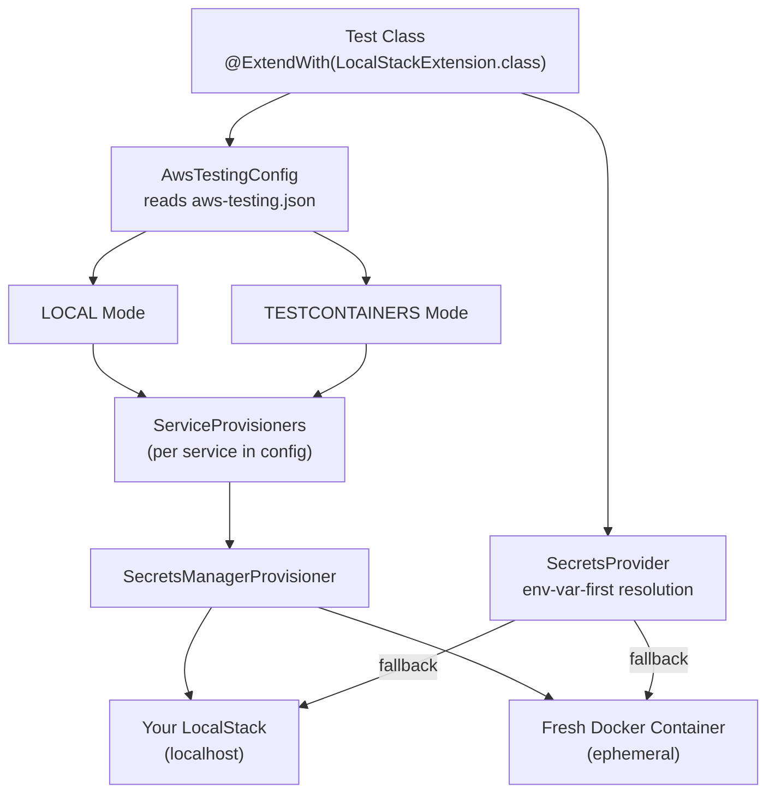

# AWS Testing with LocalStack - Configuration Guide

This project supports flexible AWS testing using **LocalStack** with two modes:

- **LOCAL mode** (default): Fast development using your running LocalStack
- **TESTCONTAINERS mode**: Isolated containers for CI/CD

These tests are **opt-in**. A normal `./gradlew build` does not require LocalStack or Docker, because the AWS-backed
suites are skipped unless you enable them explicitly with:

```zsh
-Dplaywright.aws.testing.enabled=true
```

## Quick Start

### 1. Start LocalStack (for LOCAL mode)

```bash
localstack start
```

### 2. Run Tests

```bash
./gradlew test \
  -Dplaywright.aws.testing.enabled=true \
  --tests "*AwsTestingTest"
```

Tests will then connect to your running LocalStack at `http://localhost:4566`.

## Configuration

### Configuration File: `src/test/resources/aws-testing.json`

```json
{
  "aws-testing": {
    "mode": "local",
    "services": ["secretsmanager"],
    "local": {
      "endpoint": "http://localhost:4566",
      "region": "us-east-1"
    },
    "testcontainers": {
      "image": "localstack/localstack:4.0",
      "region": "us-east-1"
    },
    "secretsmanager": {
      "secrets": {
        "playwright-practice/github": {
          "username": "test-user",
          "token": "test-token-12345"
        }
      }
    }
  }
}
```

### Configuration Options

#### mode

- `"local"` - Connect to existing LocalStack instance (fast, default)
- `"testcontainers"` - Start fresh container per test (isolated)

#### services

An array of AWS service names to enable and provision. Each entry:

1. Maps to a `LocalStackContainer.Service` for container startup
2. Triggers the corresponding `ServiceProvisioner` to create test fixtures
3. Looks up a matching config block by name (e.g. `"secretsmanager": { ... }`)

Currently supported: `"secretsmanager"`

#### local (used when mode = "local")

- `endpoint` - LocalStack endpoint URL (default: <http://localhost:4566>)
- `region` - AWS region (default: us-east-1)

#### testcontainers (used when mode = "testcontainers")

- `image` - Docker image for LocalStack (default: localstack/localstack:4.0)
- `region` - AWS region (default: us-east-1)

#### Service-specific config blocks

Each service listed in `"services"` can have its own config block at the top level.
For example, `"secretsmanager"` contains the secrets to pre-create:

```json
"secretsmanager": {
  "secrets": {
    "secret/name": {
      "field1": "value1",
      "field2": "value2"
    }
  }
}
```

## Adding a New Service Provisioner

To add support for a new AWS service (e.g. S3):

1. **Create a provisioner class** in `oscarvarto.mx.aws`:

   ```java
   public class S3Provisioner implements ServiceProvisioner {

       @Override
       public LocalStackContainer.Service service() {
           return LocalStackContainer.Service.S3;
       }

       @Override
       public void provision(String endpoint, String region, Config serviceConfig) {
           // Create buckets, upload objects, etc.
       }
   }
   ```

2. **Register it** in `ServiceProvisioner.forService()`:

   ```java
   static ServiceProvisioner forService(String serviceName) {
       return switch (serviceName) {
           case "secretsmanager" -> new SecretsManagerProvisioner();
           case "s3"             -> new S3Provisioner();
           default               -> null;
       };
   }
   ```

3. **Add config and enable** in `aws-testing.json`:

   ```json
   {
     "aws-testing": {
       "services": ["secretsmanager", "s3"],
       "s3": {
         "buckets": ["my-test-bucket"]
       }
     }
   }
   ```

## Modes Explained

### LOCAL Mode (Development)

**Use this for:**

- Fast test iteration during development
- Debugging with persistent data
- Working with LocalStack Pro features

**Requirements:**

```bash
localstack start  # Must be running
```

**Behavior:**

- Connects to `http://localhost:4566`
- Provisions all configured services on-the-fly
- Reuses your existing LocalStack auth token
- **Fast** - no container startup time

### TESTCONTAINERS Mode (CI/CD)

**Use this for:**

- Continuous Integration pipelines
- Parallel test execution
- Complete test isolation
- No LocalStack installation required

**Requirements:**

- Docker running

**Behavior:**

- Starts fresh LocalStack container with all configured services
- Provisions test fixtures in the new container
- **NO access** to your LocalStack auth token or cloud features
- Container automatically stops after tests
- **Slower** - container startup time (~10-30 seconds)

## Switching Modes

### For CI/CD (Testcontainers)

Edit `src/test/resources/aws-testing.json`:

```json
{
  "aws-testing": {
    "mode": "testcontainers"
  }
}
```

Or set via environment variable in CI:

```bash
# Enable the AWS test suite and override mode via system property
./gradlew test \
  -Dplaywright.aws.testing.enabled=true \
  -Daws-testing.mode=testcontainers
```

### For Development (Local)

Default configuration:

```json
{
  "aws-testing": {
    "mode": "local"
  }
}
```

## Important: Auth Token & Data Isolation

### What Carries Over?

**LOCAL Mode:**

- Your LocalStack auth token (`localstack auth set-token`)
- All existing secrets and state
- LocalStack Pro/Enterprise features
- Persistent data volumes

**TESTCONTAINERS Mode:**

- ❌ **NO auth token** - starts completely fresh
- ❌ **NO existing secrets** - must create programmatically
- ❌ **NO Pro/Enterprise features** unless configured separately
- ❌ **NO persistent data** - container is destroyed after tests

### Why This Matters

If you use LocalStack Pro features locally (like advanced services), they **will NOT** be available in Testcontainers
mode unless you:

1. Pass the auth token to the container (via environment variables)
2. Configure the container with your Pro credentials

Example for Pro in Testcontainers (advanced):

```java
localstack = new LocalStackContainer(DockerImageName.parse(image))
    .withServices(services)
    .withEnv("LOCALSTACK_AUTH_TOKEN", System.getenv("LOCALSTACK_AUTH_TOKEN"));
```

## Writing Tests

### Basic Test with Configuration

```java
@ExtendWith(LocalStackExtension.class)
class MyAwsTest {

    @Test
    void testSecrets() {
        // Automatically uses configured mode
        @Nullable String secret = SecretsProvider.get("GITHUB_USER");
        assertThat(secret).isEqualTo("test-user");
    }
}
```

### Accessing Configuration in Tests

```java
@Test
void checkConfiguration() {
    AwsTestingConfig config = AwsTestingConfig.getInstance();

    if (config.isLocalMode()) {
        System.out.println("Using endpoint: " + config.getLocalEndpoint());
    } else {
        System.out.println("Using image: " + config.getTestcontainersImage());
    }

    // Access service-specific configuration
    Config smConfig = config.getServiceConfig("secretsmanager");
}
```

### Creating Custom Secrets

If you need additional secrets beyond what's in the config:

```java
@BeforeEach
void setup() {
    AwsTestingConfig config = AwsTestingConfig.getInstance();
    String endpoint = config.isLocalMode()
        ? config.getLocalEndpoint()
        : LocalStackExtension.getContainer()
            .getEndpoint().toString();

    SecretsManagerClient client = SecretsManagerClient.builder()
        .endpointOverride(URI.create(endpoint))
        .region(Region.of("us-east-1"))
        .credentialsProvider(StaticCredentialsProvider.create(
            AwsBasicCredentials.create("test", "test")))
        .build();

    // Create custom secret
    client.createSecret(CreateSecretRequest.builder()
        .name("my/custom/secret")
        .secretString("{\"key\": \"value\"}")
        .build());
}
```

## Troubleshooting

### Tests fail with "Connection refused"

**LOCAL Mode:**

```bash
# Check LocalStack is running
localstack status

# Start if needed
localstack start
```

**TESTCONTAINERS Mode:**

```bash
# Check Docker is running
docker ps

# Check Testcontainers can access Docker
./gradlew test --tests "*AwsTestingTest" --info
```

### Secrets not found

1. Check `aws-testing.json` has the secrets defined under `"secretsmanager"` → `"secrets"`
2. Check the secret name matches between config and test
3. For LOCAL mode, check secrets exist:

   ```bash
   awslocal secretsmanager list-secrets
   ```

### Auth token not working in Testcontainers

This is expected! Testcontainers creates isolated containers. To use Pro features:

1. Pass auth token as environment variable
2. Modify `LocalStackExtension` to include the token

### Mode not switching

Configuration and secrets are cached. Reset both between tests:

```java
@AfterEach
void tearDown() {
    SecretsProvider.reset();
    AwsTestingConfig.reset();
}
```

## Architecture



## Files Overview

- `src/test/resources/aws-testing.json` - Main configuration
- `oscarvarto.mx.aws.AwsTestingConfig` - Configuration reader (services list, service-specific config)
- `oscarvarto.mx.aws.SecretsProvider` - Env-var-first secret resolution with AWS Secrets Manager fallback
- `oscarvarto.mx.aws.LocalStackExtension` - JUnit 5 extension (service-driven provisioning loop)
- `oscarvarto.mx.aws.ServiceProvisioner` - Strategy interface for per-service setup
- `oscarvarto.mx.aws.SecretsManagerProvisioner` - Provisions test secrets in LocalStack
- `oscarvarto.mx.aws.SecretsProviderAwsTestingTest` - Integration tests

## References

- [LocalStack Documentation](https://docs.localstack.cloud/)
- [Testcontainers LocalStack Guide](https://testcontainers.com/guides/testing-aws-service-integrations-using-localstack/)
- [AWS SDK for Java v2](https://docs.aws.amazon.com/sdk-for-java/latest/developer-guide/home.html)
